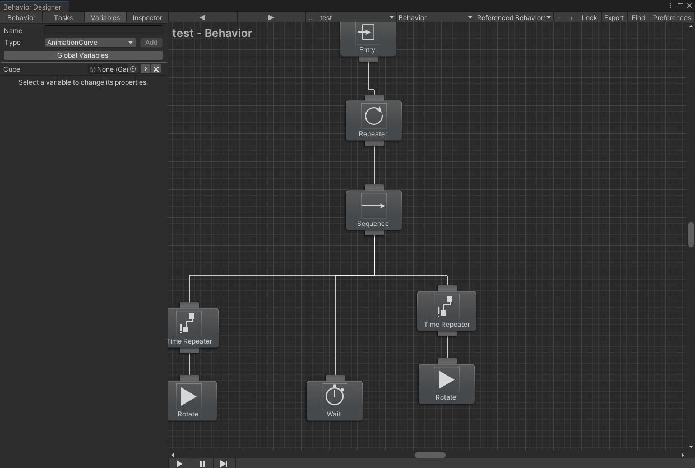
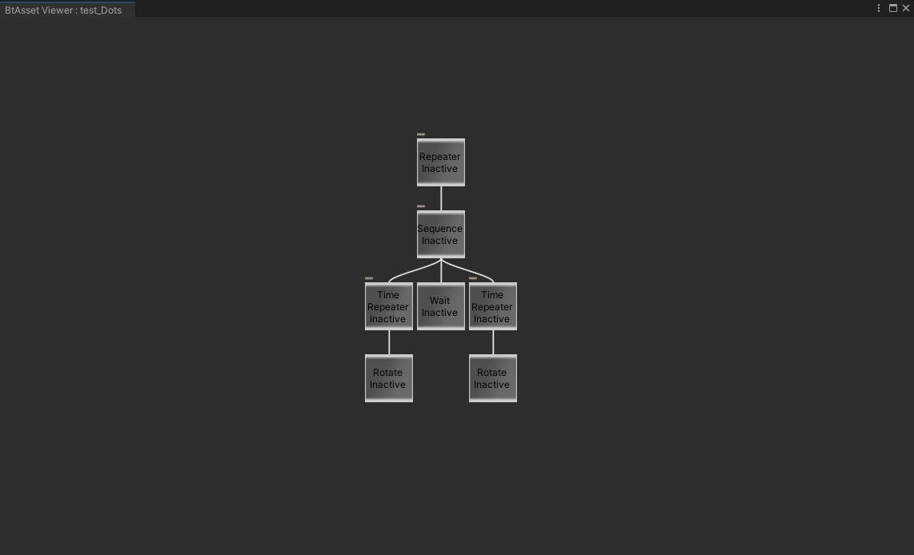
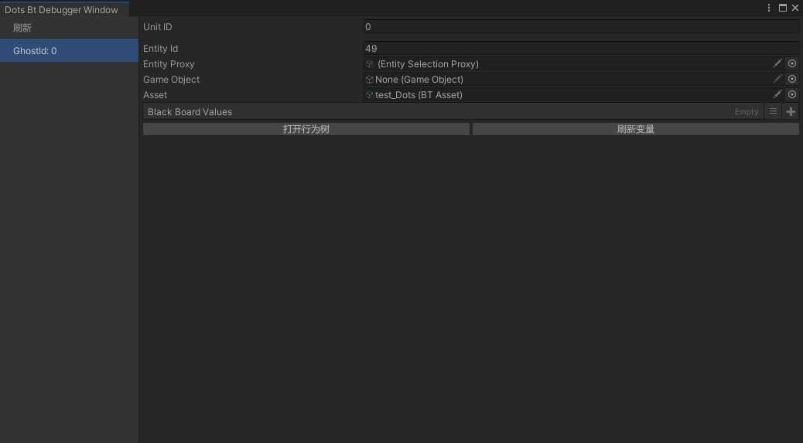
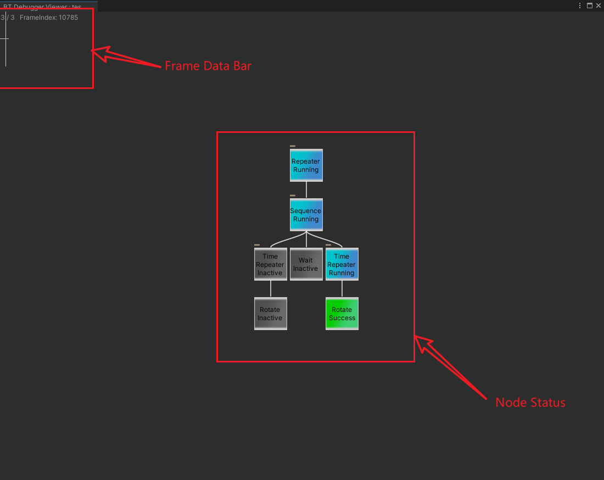

# BehaviorDesignerDots
Dots Version for Behavior designer, Unity Ecs

Design the bt with <b>Behavior Designer</b> , convert to dots asset  
running with dots asset

# Dep 
Behavior Designer  (You Should Buy for youself)  
Sirenix.Odin (You Should Buy for youself)  

com.unity.entities  1.0.16  
com.unity.entities.graphics 1.0.16  (need draw)  
com.unity.logging 1.0.16  

# Features
* Can Run with Parallel
* Burst does not work

# ScreenShot

